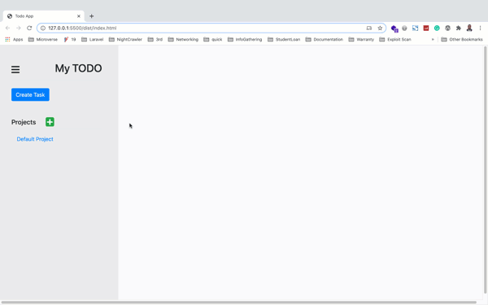

# TODO APP

In this project, we built a simple Todo App using Webpack and ES6 by dynamically creating a majority of the DOM elements. Localstorage was used to persist data accross user's session.

- DOM Manipulation with JavaScript
- LocalStorage
- Bootstrap



## Built With

- HTML
- JavaScript
- Webpack
- BootStrap

## Live Demo
[Live Demo Link](https://acushlakoncept.github.io/todo/)


## Getting Started

To get a local copy of the repository please run the following commands on your terminal:

```bash
$ cd <folder>
$ git clone https://github.com/acushlakoncept/todo.git
$ cd todo
$ npm install
$ npm run start
```

## Author

**Uduak Essien**

- Github: [@acushlakoncept](https://github.com/acushlakoncept/)
- Twitter: [@acushlakoncept](https://twitter.com/acushlakoncept)
- Linkedin: [acushlakoncept](https://www.linkedin.com/in/acushlakoncept/)

👤 **Adedeko Olawale**

- Github: [@OlawaleJoseph](https://github.com/OlawaleJoseph)
- Twitter: [@javanode123](https://twitter.com/javanode123)
- Linkedin: [olawale-adedeko](http://www.linkedin.com/in/olawale-adedeko)


## 🤝 Contributing

Contributions, issues and feature requests are welcome!

Feel free to check the [issues page](https://github.com/acushlakoncept/todo/issues).

## Show your support

Give a ⭐️ if you like this project!